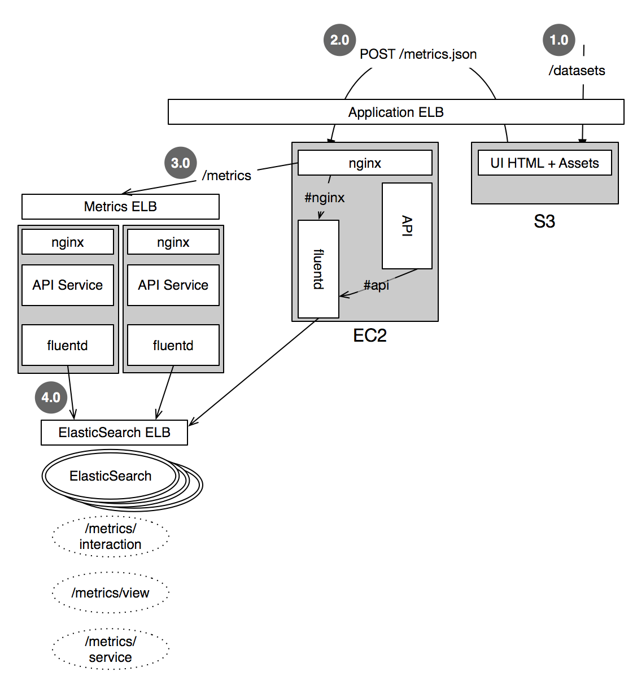

An API application that provides analytics tracking and querying from distributed web applications. 

## Goal

Metronome is a simple application that provides an API similar to Google Analytics or Piwik for applications to track usage metrics and the ability to query these for statistics on usage flow, time, errors and recommendations. 

Metronome seeks to support high-scale logging (millions of events per day), with private and on-premise deployments that preclude cloud-only (public) solutions. Additionally it provides a client API for tracking such as HTML web applications as well as server logging for HTTP API's and backend services. Lastly it can be customized based on the types of queries necessary for the application.

## Architecture

Metronome is based on ElasticSearch as the scaleable data store for all log messages. Logstash format is the common format for any application that provides for a common data structure. Kibana can be used as a customizable UI dashboard for tracking all analytics. Metronome itself is only an HTTP API.

### Client Logging

The HTTP API allows developers to send `POST /tick` with flat JSON hash of additional parameters. This allows the developer to track arbitrary parameters that can be used for application specific analytics such as page performance, user interaction, and error reporting.

### Server Logging

[Logstash logger](http://logstash.net/) or [FluentD](http://www.fluentd.org/) provide server-side clients that can push all log messages from web processes (e.g. Apache, NGINX) or from applications by directly calling to Fluentd over provided sockets.

Additionally, fluentd will push logs to S3 buckets for long-term archival storage.




## Roadmap

Metronome is currently alpha development and not ready for any usage.

## Installing

```
bundle install
elasticsearch --config=/usr/local/opt/elasticsearch/config/elasticsearch.yml
ruby metronome.rb
```
